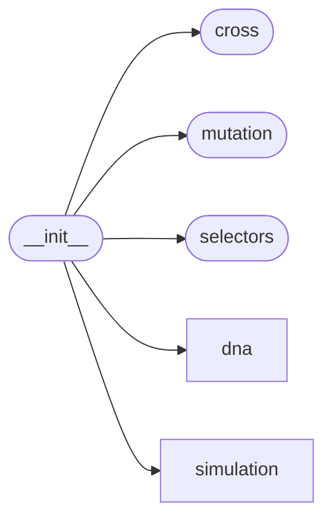

# Code Overview

[_Documentation generated by Documatic_](https://www.documatic.com)

<!---Documatic-section-Codebase Structure Python-start--->
## Codebase Structure Python

The codebase has a single-depth folder structure,
                with 12 code files in total.

<!---Documatic-block-system_architecture-start--->

<!---Documatic-block-system_architecture-end--->

# #
<!---Documatic-section-Codebase Structure Python-end--->

<!---Documatic-section-Key Objects-start--->
## Key Objects

There are exposed imports at level-0
from the source directory (genetics)

<!---Documatic-block-genetics-start--->

	
<code>genetics</code> (Click to Expand!)

* `genetics.cross.one_point_crossover`
* `genetics.cross.two_point_crossover`
* `genetics.cross.uniform_point_crossover`
* `genetics.dna.binary.DNABinary`
* `genetics.dna.component.DNAComponent`
* `genetics.dna.segment.DNASegment`
* `genetics.dna.structured.arrayed_segment`
* `genetics.dna.structured.structured_segment`
* `genetics.mutation.mutation_rate`
* `genetics.selectors.tournament`
* `genetics.simulation.discrete.DiscreteSimulation`

<!---Documatic-block-genetics-end--->

# #
<!---Documatic-section-Key Objects-end--->

<!---Documatic-section-Important Functions-start--->
## Important Functions

<!---Documatic-block-important_funcs-start--->
<!---Documatic-block-most_used_funcs-start--->
### Most Utilised Functions

* [genetics.dna.structured.structured_segment](6-genetics_dna.md#genetics.dna.structured.structured_segment) (2 times)
* [genetics.dna.structured.arrayed_segment](6-genetics_dna.md#genetics.dna.structured.arrayed_segment) (2 times)
* [genetics.dna.base.combine_element_pairs](6-genetics_dna.md#genetics.dna.base.combine_element_pairs) (2 times)
* [genetics.cross.one_point_crossover](5-genetics_cross.md#genetics.cross.one_point_crossover) (1 times)
* [genetics.cross.two_point_crossover](5-genetics_cross.md#genetics.cross.two_point_crossover) (1 times)
* [genetics.cross.uniform_point_crossover](5-genetics_cross.md#genetics.cross.uniform_point_crossover) (1 times)
* [genetics.mutation.mutation_rate](3-genetics_mutation.md#genetics.mutation.mutation_rate) (1 times)
* [genetics.selectors.tournament](4-genetics_selectors.md#genetics.selectors.tournament) (1 times)
<!---Documatic-block-most_used_funcs-end--->

<!---Documatic-block-end_user_funcs-start--->
### End User Exposed Functions

* genetics.simulation.discrete.DiscreteSimulation
* [genetics.dna.structured.arrayed_segment](6-genetics_dna.md#genetics.dna.structured.arrayed_segment)
* [genetics.mutation.mutation_rate](3-genetics_mutation.md#genetics.mutation.mutation_rate)
* [genetics.selectors.tournament](4-genetics_selectors.md#genetics.selectors.tournament)
* [genetics.cross.one_point_crossover](5-genetics_cross.md#genetics.cross.one_point_crossover)
* genetics.dna.binary.DNABinary
* [genetics.dna.structured.structured_segment](6-genetics_dna.md#genetics.dna.structured.structured_segment)
* [genetics.cross.two_point_crossover](5-genetics_cross.md#genetics.cross.two_point_crossover)
* genetics.dna.segment.DNASegment
* genetics.dna.component.DNAComponent
* [genetics.cross.uniform_point_crossover](5-genetics_cross.md#genetics.cross.uniform_point_crossover)
<!---Documatic-block-end_user_funcs-end--->
<!---Documatic-block-important_funcs-end--->

# #
<!---Documatic-section-Important Functions-end--->

<!---Documatic-section-Class Hierarchy-start--->
## Class Hierarchy

<!---Documatic-block-genetics.dna.base.DNABase-start--->

	
<code>genetics.dna.base.DNABase</code> (Click to Expand!)

* genetics.dna.binary.DNABaseBinary
* genetics.dna.component.DNAComponent
* genetics.dna.segment.DNABaseSegment

<!---Documatic-block-genetics.dna.base.DNABase-end--->

<!---Documatic-block-genetics.dna.binary.DNABaseBinary-start--->

	
<code>genetics.dna.binary.DNABaseBinary</code> (Click to Expand!)

* genetics.dna.binary.DNABinary

<!---Documatic-block-genetics.dna.binary.DNABaseBinary-end--->

<!---Documatic-block-genetics.dna.segment.DNABaseSegment-start--->

	
<code>genetics.dna.segment.DNABaseSegment</code> (Click to Expand!)

* genetics.dna.segment.DNASegment

<!---Documatic-block-genetics.dna.segment.DNABaseSegment-end--->

# #
<!---Documatic-section-Class Hierarchy-end--->

[_Documentation generated by Documatic_](https://www.documatic.com)